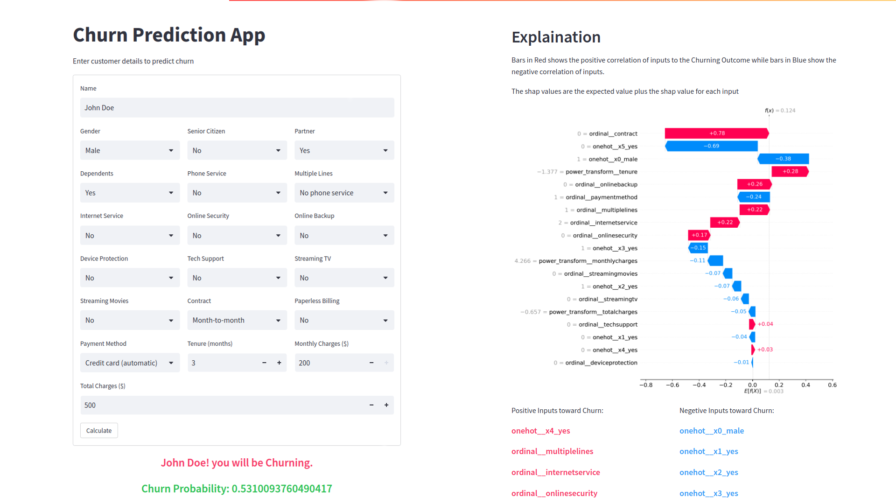

# Churn Prediction App using XGBoost Classifier and SHAP (Explaination statistics)

## Objective

The Employee Churn Prediction model project aims to help organizations predict the likelihood of employees leaving the company, allowing them to take proactive measures to retain valuable talent. The project uses historical employee data to train a machine learning model that can predict the probability of an employee leaving the organization. The model is then integrated into a Streamlit app that allows users to input employee information and receive a prediction on the likelihood of that employee churning. The app also provides insights into the factors that contribute to an employee's decision to leave, helping organizations make data-driven decisions to retain employees.

This is a Streamlit app that predicts customer churn for a telecommunications company based on user inputs. The app loads a trained XGBoost classifier model and applies it to the user input data to predict whether or not the customer is likely
to churn.


## Key Point
* Explainable model : is a type of machine learning model that can provide interpretable explanations for its predictions or decisions. In other words, It is a model that can explain the reasoning behind its output, allowing users to understand why a particular prediction was made.

Explainable models are particularly important in situations where the decision-making process needs to be transparent, such as in the medical or legal fields. By providing interpretable explanations for its decisions, an explainable model can help users understand why a particular prediction was made, and in some cases, can provide insights into how to improve the model's performance.


## Metrics

```
 'accuracy' : 0.845111326234269,
 'precision': 0.8450843546143052,
 'recall'   : 0.8451113262342691,
 'f1'       : 0.8450851494399377,
```

## APP



## How to use the app

* Clone or download the code from the Github repository.
* Open the terminal and navigate to the directory where the code is saved.
* Install the necessary libraries by running
`pip install -r requirements.txt`
* Run the app by executing the command
`streamlit run app.py`.
* The app will open in a new tab on your default browser.
* Enter customer details such as name, gender, senior citizen etcetera.
* Click on the "Calculate" button to predict whether the customer is likely to churn.
* The app will display a message with the prediction result, either "Not Churning" or "Churning".
* Additionally, the app will display a visual explanation of the prediction result.

## Libraries used

joblib
pandas
numpy
xgboost
shap
streamlit

## Credits

This app was developed by [Your Name Here] as a part of a data science project. The code is open source and free to use for personal or commercial purposes.